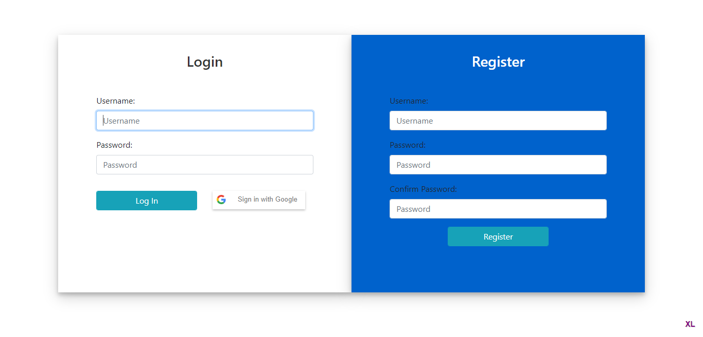

# **Minify - URL Shorten API**

Minify is a URL Shortening API, which works on the following Authentication mechanisms

1. DB Authentication, using Form login
2. API Token based Authentication
3. Google Authentication

## Functionalities:

1. Creating shorten URL Via UI
2. Managing URLs via UI
3. Creating shorten URL Via API / Swagger UI
4. Redirecting shorten URL

### Login Page



### Home Page


#### Swagger UI


#### Redirection

Redirection has been done by the shorten URL

```
http://localhost:8081/r/GkPNMK
```

